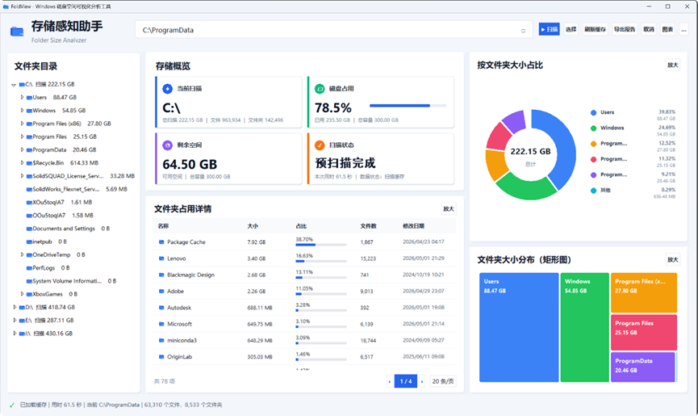
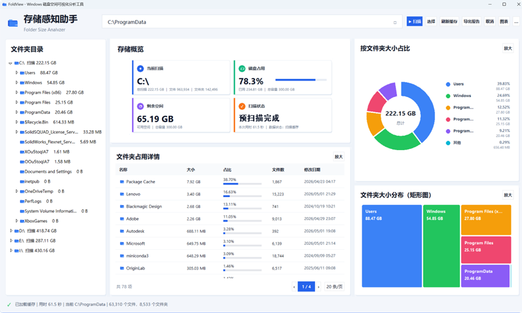
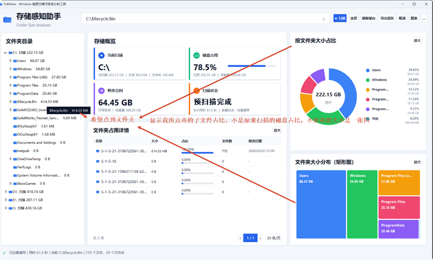
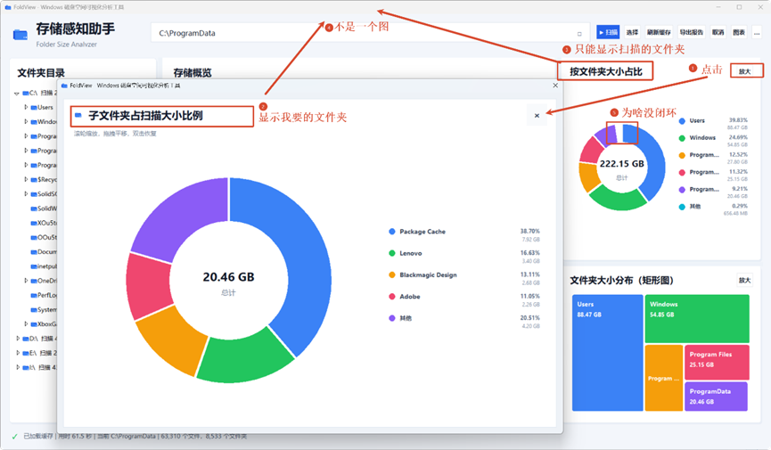
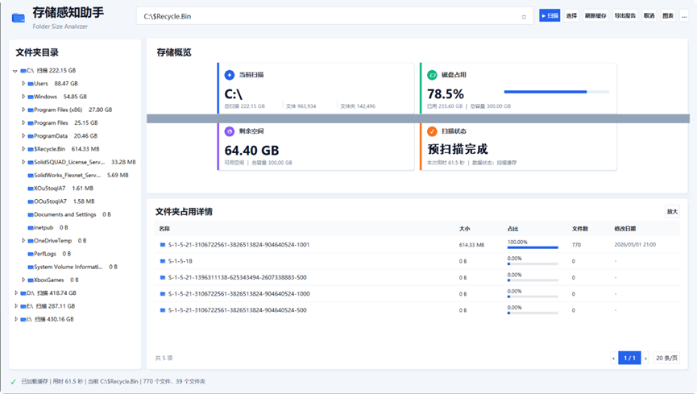
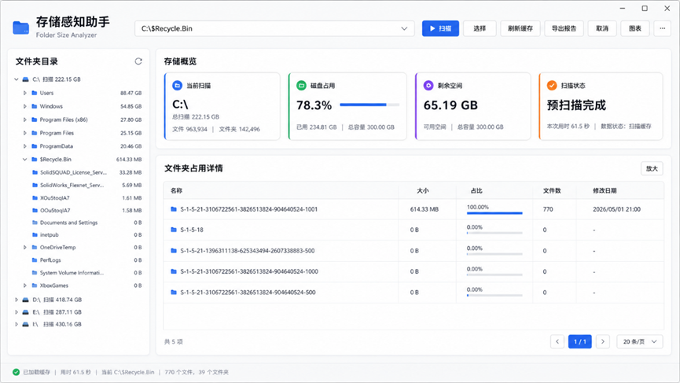

# FoldView - Windows Disk Space Analyzer


FoldView 是一款面向 Windows 本地环境的磁盘空间可视化分析工具，也称为“存储感知助手”。

它的基本想法很简单：当电脑磁盘空间越来越满时，用户不应该只看到一个抽象的“C 盘快满了”，而应该能够快速看清楚——到底是哪些文件夹占用了主要空间，它们之间的占比关系如何，哪些目录最值得进一步检查或清理。

本项目基于 Python + Tkinter 开发，通过文件夹扫描、数据统计、表格展示和图形化表达，将本地磁盘空间使用情况转化为更加直观的界面信息。

> 当前项目是本人第一个 GitHub 仓库，也是本科毕业前完成的一次个人编程实践。项目仍处于原型完善阶段，部分界面联动、图表绘制和窗口自适应细节仍有待继续优化。

---

## 界面预览


---

## 为什么做这个项目

在 Windows 电脑长期使用过程中，磁盘空间不足是一个非常常见的问题。很多时候，系统只会提示磁盘空间不够，但用户很难立刻判断问题来自哪里。

文件资源管理器可以查看文件和文件夹，但它更适合“浏览文件”，并不适合“分析空间”。如果想知道某个磁盘中到底是 `Users`、`Windows`、`Program Files`，还是某个软件缓存目录占用了大量空间，通常需要不断进入目录、右键查看属性、等待统计结果，过程比较繁琐。

因此，我希望尝试做一个小型本地工具，把磁盘空间分析这件事变得更直观：

用户选择一个磁盘或文件夹后，程序自动扫描其内部结构，并把各子文件夹的大小、占比和分布关系展示出来。这样用户不仅能看到数字，也能通过图表理解空间占用结构。

---

## 项目做了什么

FoldView 将磁盘空间分析过程拆分为几个连续步骤：

首先，用户在顶部路径栏中输入或选择需要扫描的磁盘 / 文件夹。程序会在后台遍历该目录，统计其中的文件数量、文件夹数量、各子目录大小和修改时间。

扫描完成后，界面会把结果同时呈现在三个层次中：

左侧目录树用于展示文件夹层级关系，让用户知道当前路径处在整个磁盘结构中的什么位置。

中间区域展示当前扫描对象的总大小、磁盘占用情况以及子文件夹详情表格，适合精确查看每个目录的大小、占比、文件数量和修改时间。

右侧图表区域则通过环形图和矩形树图表达空间分布。环形图更适合观察各文件夹所占比例，矩形树图更适合观察不同文件夹之间的体量差异。

这个项目的目标不是替代成熟的商业磁盘管理软件，而是作为一个可运行、可学习、可继续扩展的 Python 桌面应用，展示如何把文件系统扫描、数据组织和 GUI 可视化结合起来。

---

## 设计思路

FoldView 的界面设计主要围绕“从路径到结构，再到占比”的分析逻辑展开。

顶部是路径选择和操作区，负责完成扫描入口、刷新、导出和取消等操作。

左侧是目录树，强调文件夹之间的层级关系。

中间是数据主体区域，承担总览和详情查看功能。这里既要让用户看到当前扫描目录的整体情况，也要能具体定位到占用空间较大的子文件夹。

右侧是图表区域，用更直观的方式展示空间占比和大小分布。相比单纯的表格，图表可以帮助用户快速识别“哪个文件夹最大”“哪些文件夹占比接近”“是否存在异常大的目录”。

整体界面采用浅色背景和卡片式布局，希望尽量接近现代 Windows 桌面工具的视觉风格，同时保持结构清晰。

---

## 技术实现

项目主要使用 Python 标准库和 Tkinter 完成。

文件夹扫描部分通过递归遍历实现。程序会统计每个文件夹节点的大小、文件数量、子文件夹数量和修改时间，并将结果组织为树状结构。这样同一份扫描数据既可以用于左侧目录树，也可以用于中间表格和右侧图表。

由于扫描大目录时可能需要较长时间，项目使用后台线程执行扫描任务，避免界面在扫描过程中完全卡死。扫描进度通过队列传回主界面，再由主界面定时刷新状态信息。

图形界面主要基于 Tkinter 和 ttk 构建，包括路径栏、按钮、目录树、表格、Canvas 图表和状态栏。环形图和矩形树图主要通过 Canvas 绘制完成。

项目还提供了 `build_exe.ps1` 和 `FoldView.spec`，可以使用 PyInstaller 将 Python 程序打包为 Windows 可执行文件。

---

## 当前完成情况

目前版本已经实现了一个可运行的原型：

- 可以选择或输入本地路径进行扫描；
- 可以统计文件夹大小、文件数量和文件夹数量；
- 可以在表格中查看子文件夹占用情况；
- 可以通过环形图查看空间占比；
- 可以通过矩形树图查看大小分布；
- 可以进行后台扫描和取消扫描；
- 可以通过 PyInstaller 打包为 Windows 可执行程序；
- 可以导出扫描报告。

同时，项目还保留了一些没有完全打磨的问题。它们既是当前版本的不足，也是后续继续迭代的方向。

---

## 使用方式

### 1. 克隆项目

```powershell
git clone https://github.com/2022015205/FoldView-Windows-Disk-Analyzer.git
cd FoldView-Windows-Disk-Analyzer
```

### 2. 运行程序

```powershell
py foldview.py
```

或者：

```powershell
python foldview.py
```

---

## 打包为 Windows 可执行程序

### 1. 安装 PyInstaller

```powershell
pip install pyinstaller
```

### 2. 执行打包脚本

```powershell
.\build_exe.ps1
```

### 3. 查看生成文件

打包完成后，可执行文件通常位于：

```text
dist\FoldView.exe
```

双击 `FoldView.exe` 即可运行。

---

## 项目结构

```text
FoldView-Windows-Disk-Analyzer
├── foldview.py              # 主程序入口
├── foldview_modern.py       # 现代化界面版本或辅助版本
├── build_exe.ps1            # Windows 打包脚本
├── FoldView.spec            # PyInstaller 打包配置
├── README.md                # 项目说明文件
├── screenshots/             # 项目截图
│   ├── interface-overview.png
│   └── known-issues/
│       ├── bug-01-overview-state-mismatch.png
│       ├── bug-02-overview-state-mismatch.png
│       ├── bug-03-current-folder-chart-not-sync-annotated.png
│       ├── bug-04-chart-popup-and-donut-gap.png
│       ├── bug-05-no-chart-layout-issue.png
│       └── bug-06-no-chart-layout-target.png
└── .gitignore               # Git 忽略文件
```

---

## 已知问题与后续优化

当前项目仍处于原型完善阶段，以下问题后续需要继续优化。为了更直观地记录问题，README 中保留了全部 bug 标注图和对照图，便于后续对照修改。

### Bug 图示总览

#### 1. 选中 `C:\ProgramData` 后，部分概览与图表仍显示 C 盘根目录数据



#### 2. 同一路径下，存储概览区域存在状态与数据不一致现象



#### 3. 选中 `$Recycle.Bin` 后，表格已切换，但右侧图表仍显示扫描根目录占比



#### 4. 放大图窗口与右侧小图标题、数据源、环形图闭合效果仍需统一



#### 5. 隐藏图表区域后的三大区域布局存在拉伸、遮挡或错位问题



#### 6. 无图表模式下希望形成更稳定的布局效果



---

<details>
<summary>1. 当前选中文件夹与右侧图表、放大图、存储概览尚未完全统一联动</summary>

目前用户点击左侧文件夹后，中间表格能够切换到该文件夹内容，但右侧环形图、矩形树图、放大图以及部分存储概览信息仍可能显示扫描根目录或磁盘根目录的数据，导致路径栏、表格、图表标题、中心总量、图例和放大图内容不一致。

理想逻辑应为：用户点击哪个文件夹，右侧图表、放大图和存储概览就同步展示该文件夹内部子文件夹 / 文件的大小占比与统计结果。

例如，当前选择 `C:\ProgramData` 时，图表标题应显示为 `C:\ProgramData 子文件夹大小占比`，图例应显示 `Package Cache`、`Lenovo`、`Adobe`、`Microsoft` 等当前文件夹内部子项，而不应继续显示 C 盘根目录下的 `Users`、`Windows`、`Program Files` 等数据。

</details>

<details>
<summary>2. 部分环形图存在视觉不完整问题</summary>

部分环形图顶部会出现较明显的断口，看起来像圆环缺失一块。该问题可能与绘图参数、扇区间距、百分比累计误差或数据核算有关。

后续需要进一步排查原因，并根据实际情况修正绘图方式、占比计算逻辑或扇区分隔方式。最终效果应保证圆环视觉上完整闭合；如果需要扇区分隔，也应控制为轻微分隔，避免出现明显缺口。

</details>

<details>
<summary>3. 图表模式下存储概览区域占用空间偏大</summary>

当前“当前扫描、磁盘占用、剩余空间、扫描状态”四个信息卡片的高度、内边距、图标和字号仍偏大，导致存储概览外层白色区域过高，占用了较多中间展示空间。

后续将进一步压缩图表模式下的顶部概览区，使其更像辅助状态信息：减少卡片高度、内边距、图标尺寸和字号，并让外层背景高度随内容自然收缩，避免出现大面积空白。

</details>

<details>
<summary>4. 窗口拖动、缩放或调整分栏时布局仍需稳定</summary>

当前在拖动窗口、缩放界面或调整分栏时，偶尔会出现图表闪烁、模块跳动、卡片错位、重新堆叠或局部空白等问题。

后续计划统一 resize 与重绘逻辑，减少多个 `<Configure>` 回调重复触发造成的布局抖动；同时通过 debounce 机制，在停止拖动约 150–220ms 后再统一刷新图表。图表重绘前也会统一清空旧 canvas，避免多个图表对象叠加。

</details>

<details>
<summary>5. 无图表模式下的三大区域布局仍需进一步规范</summary>

在没有图表数据或右侧图表区隐藏时，页面会切换为“左侧文件夹目录 + 上方存储概览 + 下方文件夹占用详情”的三大区域布局。这个方向是正确的，但当前中间区域横向拉宽后，存储概览四个信息卡片容易被过度拉伸，导致卡片高度、间距、图标和字号比例失控。

后续应将无图表模式下的存储概览固定为紧凑的 1×4 横向卡片布局：每张卡片限制最大宽度和最大高度，保持统一内边距、图标尺寸和字号层级。即使外层容器变宽，卡片也不应无限拉长或放大，而应保持紧凑、均衡和稳定。

</details>
---

## 适用场景

FoldView 适用于 Windows 电脑磁盘空间清理、文件夹占用分析、本地文件管理、Python GUI 学习、课程设计展示和个人软件作品集整理等场景。

---

## 隐私说明

FoldView 是本地运行的磁盘空间分析工具。

程序只读取用户指定目录下的文件夹结构、文件大小、文件数量和修改时间，不会上传、同步或远程存储任何用户数据。扫描结果仅用于本地展示和分析。

---

## 注意事项

扫描系统盘时，部分目录可能因权限限制无法访问。大型磁盘或文件数量较多的目录扫描时间可能较长。如果导出报告失败，请检查当前目录是否具有写入权限。如果打包失败，请确认 PyInstaller 已正确安装。

当前项目仍处于个人学习和原型完善阶段，部分界面细节仍需后续迭代。

---

## 致谢

本项目由中国石油大学（北京）石油工程专业本科生戴思哲于 2026 年 5 月毕业前完成，是本人在编程学习、桌面软件开发以及磁盘空间可视化分析方向上的一次阶段性实践。

在项目开发与整理过程中，感谢西南交通大学廖子兴同学给予的帮助与建议；同时感谢中国石油大学（北京）地球物理学院吴书明同学在本人作为国家公派本科插班生赴美国 The University of Tulsa 交流期间给予的支持,感谢经济专业孙宇晴同学的支持与理解。

由于个人开发经验有限，且毕业前时间较为紧张，项目中仍有一些细节尚未完全打磨。欢迎大家提出 issue、建议或改进思路。

---

## License

本项目当前作为个人学习与展示作品发布。如需复用、修改或二次开发，请保留项目来源说明。

---

## Author

DAI SIZHE  
China University of Petroleum (Beijing)  
Petroleum Engineering
